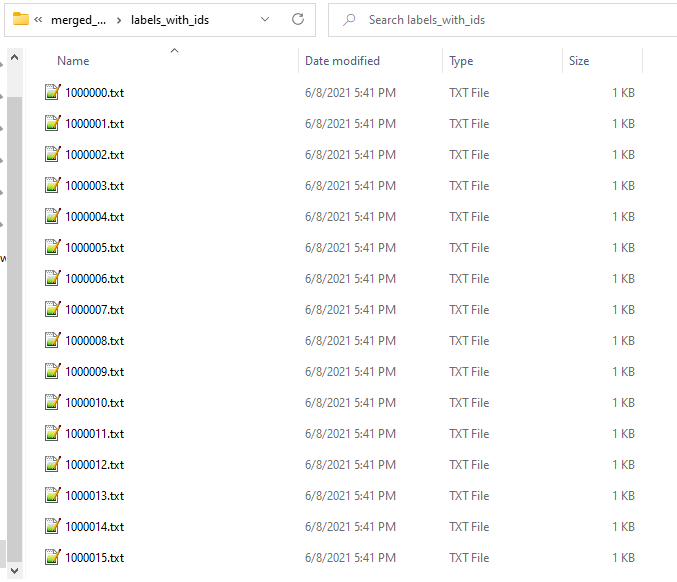
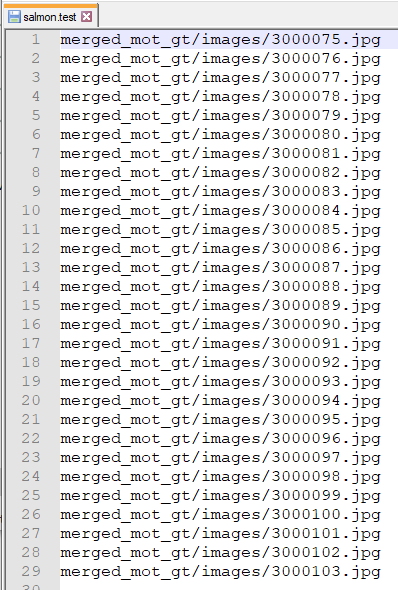

# Run the python script convert_gt_jde.py

After we have MOT Seq GT format annotations, we want to convert them to JDE format. Then, we want to split data into training, validation and test dataset.

## Convert to JDE format

To convert MOT Seq GT format to JDE format, we run this command:

```
convert_gt_jde.py convert {path to the merged mot gt folder}
```

An example of this command is:

```
python convert_gt_jde.py convert merged_mot_gt
```

After running the script, please go to the merged_mot_gt folder you have specified in the command, you will find a new folder created named labels_with_ids. The folder labels_with_ids contains JDE annotation files.




### Troubleshooting

```text
invalid literal for int() with base 10: ''
```

The root cause of this issue is likely that the CVAT images' names are not following the assumed format.

Please make sure the uploaded images on CVAT server follow this naming format:

```text
frame_000001, frame_000002, ...
```

## Split JED annotations

After we have converted annotations to JDE format, we want to split the data into train, validation and test dataset. Run this command to split data:

```
python convert_gt_jde.py split {path to folder of JDE annotations}
```

Since the python script convert MOT Seq GT to JDE at the same location, the path to folder of JDE annotations will just be the same as merged_mot_gt. An example of the command is:

```
python convert_gt_jde.py split merged_mot_gt
```

After running the script, three new files will be generated. These files specify the training, validation and test dataset accordingly.



