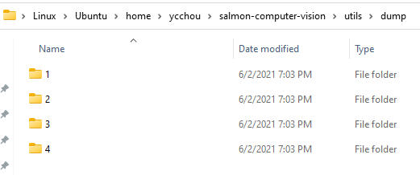

# Run dump_cvat.sh

```bash
./dump_cvat.sh {path to cvat cli.py} {username}:{password} {start_id} {last_id} {dest_dir}
```

An example of the command:

```bash
./dump_cvat.sh ../../cvat/utils/cli/cli.py username:password 1 4 dump
```

## Start ID and Last ID

The start_id and last_id in the command is the ID of the first task and the ID of the last task. This script assumes all tasks' IDs are consecutive.

You can find tasks' IDs in a file produced by make_cvat_tasks.sh script. The file name is **new_created_tasks.txt**, and this is an example of its content:

```
1
2
3
4
```

## After running dump_cvat.sh

After running the dump_cvat.sh script, we should see the following output if it succeeds.

```
Exporting task 1
STATUS 202
STATUS 202
...
STATUS 201
removed 'dump/1.zip'
Exporting task 2
STATUS 202
STATUS 202
...
STATUS 201
removed 'dump/2.zip'
...
```

Then, go to the destination folder as we have specified in the command to find the exported files. In this case, the destination folder is called dump at the same folder as of the script.




